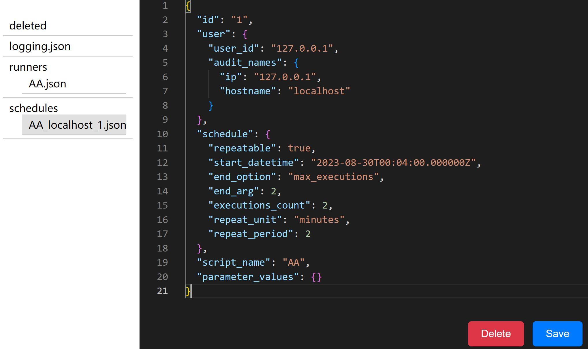

# Conf Editor

bugy/script-server scheduling configuration helper.

# Configuration

Specify the directory of your script-server conf, example: `/home/script-server/conf`.

The app runs on port `5001` by default.

# Screentshots

